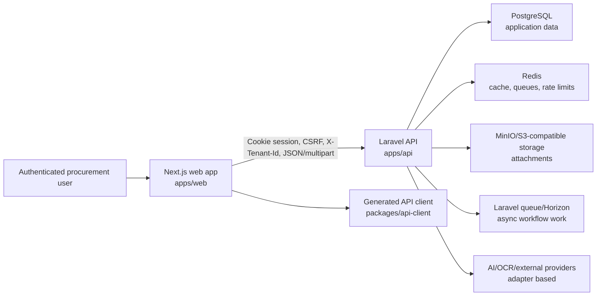
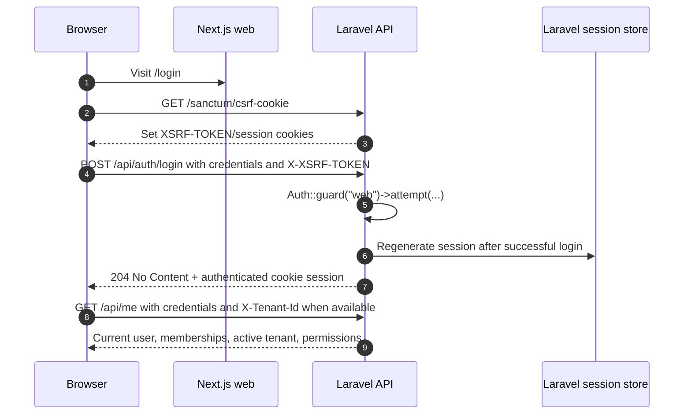
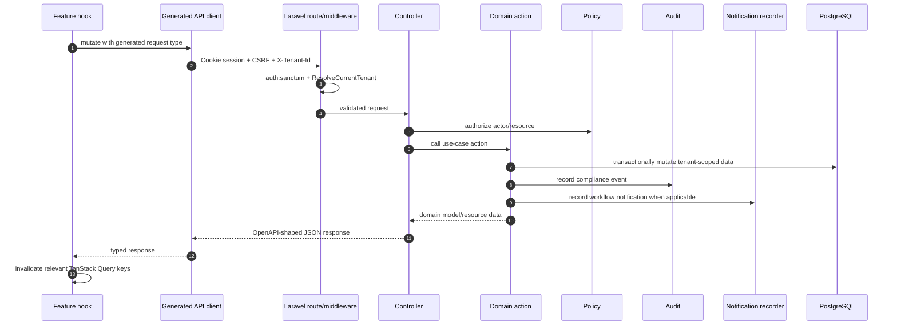
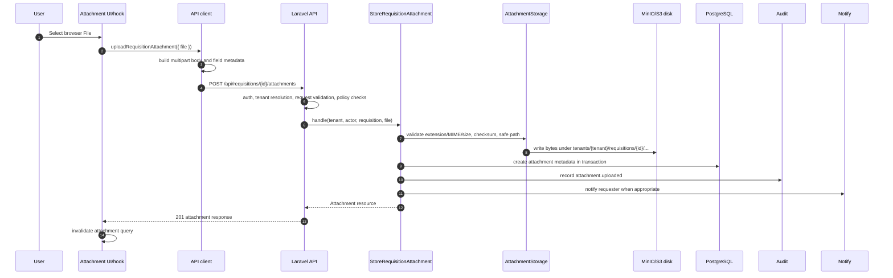

# Cognify Architecture

## Status

- Status: Active root architecture reference
- Product: Cognify
- Last updated: 2026-05-29
- Audience: engineers and agents adding or reviewing Cognify product behavior

This document explains how Cognify is architected as a software system. It is not only a repository map. A new developer should be able to read it and understand how authenticated screens, tenant-scoped API calls, backend workflow actions, generated contracts, attachments, sessions, state, audit, notifications, and verification fit together.

The structure borrows from proven architecture documentation patterns:

- [arc42](https://arc42.org/overview): goals, constraints, building blocks, runtime views, deployment, cross-cutting concepts, decisions, quality requirements, risks, and glossary.
- [C4 model](https://c4model.com/): context, container, component, and code-level views for explaining a system at different levels of detail.
- [Next.js App Router documentation](https://nextjs.org/docs/app): route groups, layouts, Server Components by default, and Client Components for browser state and interactivity.
- [Laravel Sanctum SPA authentication documentation](https://laravel.com/docs/sanctum#spa-authentication): cookie/session based SPA authentication, CSRF, and stateful API middleware.
- [OWASP Session Management Cheat Sheet](https://cheatsheetseries.owasp.org/cheatsheets/Session_Management_Cheat_Sheet.html): session identifiers, cookie security, session regeneration, and logout invalidation expectations.

## 1. Architectural Intent

Cognify is a multi-tenant enterprise procurement SaaS. The system is designed around procurement workflows rather than isolated CRUD pages. The core architectural priorities are:

1. Preserve tenant isolation in every user-facing and backend workflow.
2. Keep authentication and session behavior browser-native, explicit, and testable.
3. Treat OpenAPI as the frontend/backend contract.
4. Keep business behavior in backend domain actions and policies, not controllers.
5. Keep Cognify product UI in the web app and reusable primitives in shared packages.
6. Make file, audit, notification, and async side effects first-class workflow concerns.
7. Prefer vertical workflow slices that can be tested end to end.

The default feature-development shape is:

```txt
Business workflow
  -> Workspace UX
  -> API contract
  -> Mocked frontend workflow
  -> Backend domain behavior
  -> Real API integration
  -> Hardening and observability
```

## 2. System Context

Cognify has two deployable applications and several internal packages.



The browser never talks directly to PostgreSQL, Redis, object storage, queues, or provider APIs. All durable business decisions pass through the Laravel API, where authentication, tenant membership, authorization, validation, audit, and side effects can be enforced consistently.

## 3. Container View

| Container                            | Technology                                                                     | Responsibility                                                                                                                         | Must not own                                                                             |
| ------------------------------------ | ------------------------------------------------------------------------------ | -------------------------------------------------------------------------------------------------------------------------------------- | ---------------------------------------------------------------------------------------- |
| `apps/web`                           | Next.js App Router, React, TanStack Query, MSW, shadcn/Radix via `packages/ui` | Browser product experience, route groups, app shell, authenticated workflows, feature hooks, client-side state, mock-first UI tests    | Laravel business rules, direct persistence, direct mock imports in production components |
| `apps/api`                           | Laravel 12, Sanctum, Eloquent, queues, storage disks                           | HTTP API, authentication/session endpoints, tenant resolution, policies, domain actions, audit, notifications, storage, OpenAPI export | Screen composition, generated TypeScript contracts, frontend state                       |
| `packages/api-client`                | Orval-generated TypeScript, shared fetch/form-data helpers                     | Generated endpoints/schemas, credentials/CSRF/tenant-aware fetch helper, multipart helper, error normalization                         | Product workflow state or hand-written replacement response types                        |
| `packages/ui`                        | shadcn/Radix primitives installed through the shadcn CLI                       | Business-neutral reusable UI primitives, shadcn-managed hooks, and UI utilities                                                        | Cognify-specific shell, procurement cards, workflow copy, domain badges                  |
| `packages/config`                    | Shared tooling config                                                          | TypeScript, Tailwind, lint/test/build config                                                                                           | Business behavior                                                                        |
| `packages/schemas`, `packages/types` | Stable shared schemas/types                                                    | Cross-app stable contracts not generated from OpenAPI                                                                                  | Feature-local or API-generated shapes                                                    |

## 4. Repository Building Blocks

```txt
cognify/
  apps/
    web/                     # Next.js product frontend
    api/                     # Laravel API backend
  packages/
    api-client/              # Orval-generated API client and typed helpers
    ui/                      # reusable shadcn/Radix primitives only
    config/                  # shared TypeScript, Tailwind, tooling config
    schemas/                 # stable shared schemas when reuse is proven
    types/                   # stable shared TS contracts when not generated
  docs/
    01-product/
    02-release-management/
    03-domains/
    04-engineering/
    05-runbooks/
    06-architecture/
    07-history/
    agentic/
    superpowers/
  infrastructure/docker/     # local PostgreSQL, Redis, MinIO
  tooling/scripts/
  AGENTS.md
  DEVELOPER_GUIDELINE.md
  ARCHITECTURE.md
```

Architecture rule of thumb: shared packages are for reuse and contracts, not for hiding uncertainty. When behavior has Cognify business meaning, put it in the owning app or backend domain first.

## 4.1 Shadcn CLI Architecture

The shadcn CLI is the source of truth for default UI primitives, theme tokens, generated UI hooks, and generated UI utilities. The supported project-root command is:

```bash
pnpm dlx shadcn@latest apply --preset b2CipdfvO -c apps/web
```

This command must remain runnable from the repository root. Engineers may use it to apply the current preset, switch themes, or refresh default shadcn components. The command is intentionally pointed at `apps/web` because the web app owns the shadcn entrypoint, Tailwind CSS file, and product runtime, while shared primitives are routed into `packages/ui`.

The monorepo shadcn configuration has two required files:

- `apps/web/components.json` is the app entrypoint. It keeps app composites under `apps/web/components` and routes `ui`, `utils`, `lib`, and `hooks` aliases to `@cognify/ui`.
- `packages/ui/components.json` is the shared UI workspace config. It uses package-local `#components`, `#lib`, and `#hooks` aliases backed by `packages/ui/package.json#imports`.

`packages/ui/package.json#exports` must expose the same shared targets consumed by `apps/web/components.json`: `./components/*`, `./lib/*`, `./lib/utils`, and `./hooks/*`.

Shadcn-managed files are treated as generated defaults:

- `packages/ui/src/components/**`
- `packages/ui/src/hooks/**`
- `packages/ui/src/lib/**`
- `apps/web/app/globals.css`

Do not put Cognify-specific behavior, procurement copy, workflow state, custom variants, or one-off accessibility fixes directly into those generated files. Put product behavior in app-level composites under `apps/web/components` or feature-owned components under `apps/web/features`. If a generated primitive has a compatibility issue with the current dependency graph, prefer fixing the shadcn config, package imports/exports, dependency version, or `pnpm` dependency patch first. Any unavoidable compatibility patch must be documented in `docs/04-engineering/standards/shadcn-first-ui.md` with the reason and the verification command that protects it.

## 5. Authentication Architecture

Cognify uses browser session authentication through Laravel Sanctum's SPA pattern.

### Authentication Runtime Flow



Key implementation points:

- `apps/api/bootstrap/app.php` calls `$middleware->statefulApi()`. This is required for Sanctum's stateful SPA/session behavior.
- Login is handled by `App\Auth\Http\Controllers\AuthenticatedSessionController::store`.
- Login uses the Laravel `web` guard and regenerates the session after successful authentication.
- Logout uses `Auth::guard('web')->logout()`, invalidates the session, and regenerates the CSRF token.
- The web app calls `/sanctum/csrf-cookie` before login through `ensureCsrfCookie()`.
- The API client sends `credentials: "include"` on generated-client fetches.
- State-changing generated-client requests attach `X-XSRF-TOKEN` from the `XSRF-TOKEN` cookie when available.

### Auth Guardrails

Do:

- Use generated endpoints or feature API wrappers that preserve cookies, CSRF, error handling, and tenant headers.
- Prove auth/session changes through real route-stack tests, not only `actingAs()`.
- Keep login, logout, and forgot-password endpoints outside tenant-context middleware.
- Regenerate the session on login and invalidate it on logout.

Do not:

- Store SPA access tokens in local storage for normal web authentication.
- Hand-write fetch calls that forget `credentials: "include"`.
- Add authenticated product screens outside `SessionGate`.
- Treat tenant selection as authentication. It is a separate context-selection step after login.

## 6. Session Architecture

Sessions are server-owned. The browser holds only cookies and a best-effort active tenant hint.

| Concern              | Owner                       | Implementation                                                               |
| -------------------- | --------------------------- | ---------------------------------------------------------------------------- |
| User identity        | Laravel session             | Sanctum stateful API middleware + `web` guard                                |
| CSRF token           | Laravel/Sanctum cookie flow | `/sanctum/csrf-cookie`, `XSRF-TOKEN`, `X-XSRF-TOKEN`                         |
| Active tenant hint   | Browser local storage       | `cognify.activeTenantId`, written only after server validation               |
| Current user context | API response                | `/api/me` returns user, tenant memberships, active tenant, role, permissions |
| Route access         | Web workflow                | `SessionGate` wraps authenticated route groups                               |

The active tenant ID in local storage is not authority. The API revalidates it against authenticated membership on every tenant-resolved route through `ResolveCurrentTenant`. Browser storage writes should be best-effort and must not break the core flow if storage is unavailable.

## 7. Tenancy Architecture

Cognify currently uses a single database with explicit tenant scoping.

### Tenant Resolution

Tenant-sensitive API routes use this route shape:

```txt
auth:sanctum
  -> tenant selection endpoint can run here
  -> ResolveCurrentTenant
       -> tenant-scoped product routes
```

`ResolveCurrentTenant` does the following:

1. Requires an authenticated user.
2. Reads `X-Tenant-Id` from the request.
3. If no tenant header exists and the user has multiple tenants, raises `ambiguous_tenant`.
4. If no tenant header exists and the user has one tenant, uses that tenant.
5. Verifies the tenant exists.
6. Verifies the authenticated user belongs to that tenant.
7. Stores the tenant in `App\Tenancy\CurrentTenant` for the rest of the request.

Tenant selection is intentionally outside `ResolveCurrentTenant`:

```txt
POST /api/tenants/current
  -> auth:sanctum
  -> validate posted tenantId against authenticated membership
  -> set CurrentTenant
  -> return CurrentUserResource
  -> web stores active tenant only after success
```

This prevents a circular dependency where selecting the tenant would require an already-selected tenant.

### Tenant-Safe Data Rules

Every tenant-sensitive workflow must prove:

1. The actor is authenticated.
2. The actor belongs to the tenant or has explicit system authority.
3. The resource belongs to the current tenant.
4. Related resources also belong to the same tenant.
5. Audit events and notifications carry tenant metadata.
6. Tests include cross-tenant data that would fail if the filter were missing.

Do not rely on UI hiding alone. Backend queries, policies, actions, and model invariants must enforce tenant boundaries.

## 8. Authorization and Permissions

Cognify uses layered authorization:

- Tenant membership identifies which tenant a user can operate in.
- Tenant role describes broad role category: requester, buyer, approver, admin.
- `TenantPermissionResolver` converts role into UI-visible capability flags.
- Laravel policies enforce backend permissions on resources and actions.
- Domain actions perform additional state and ownership checks where workflow rules require them.

The `/api/me` response gives the frontend:

- `user`
- `tenants`
- `activeTenant`
- `activeRole`
- `permissions`

The app shell uses these permissions to hide or show navigation and commands. Backend policies remain the source of enforcement.

Guardrails:

- Do not expose commands before permissions are loaded.
- Do not use frontend permissions as the only authorization check.
- New workflow actions need policy coverage and route/API tests for denied cases.
- State-transition authorization belongs in backend policies and domain actions.

## 9. Frontend Architecture

The frontend is a Next.js App Router application. The root layout owns global providers. Authenticated route groups own authenticated product composition.

```txt
apps/web/app/
  (auth)/          # public auth screens
  (dashboard)/     # authenticated dashboard workflows
  (workspace)/     # authenticated focused record workspaces
  layout.tsx       # root HTML, metadata, AppProviders
  globals.css
```

### Route Composition

Authenticated layouts wrap children like this:

```txt
SessionGate
  -> AppShell
       -> ShellHeader
       -> ShellNav / MobileShellNav
       -> page content
       -> ShellFooter
       -> RightPanelHost
```

`SessionGate` calls `useCurrentUser()` and handles:

- loading state;
- unauthenticated or forbidden state;
- tenant selection when the user has multiple tenants and no active tenant;
- successful rendering once user and tenant context are available.

`AppShell` reads current user context, tenant name, role, permissions, breadcrumbs, system readiness, navigation groups, and right-panel host state. App shell behavior is Cognify-specific and belongs in `apps/web`, not `packages/ui`.

### Frontend Feature Shape

Recommended feature structure:

```txt
apps/web/features/<feature>/
  api/          # generated-client wrappers, tenant headers, view-model mapping
  components/   # feature UI
  forms/        # React Hook Form composition
  hooks/        # TanStack Query and feature hooks
  mocks/        # MSW handlers/fixtures
  schemas/      # Zod schemas
  stores/       # client-only UI state when needed
  tables/
  tests/
  types/
  utils/
  workflows/    # screen-level feature composition
```

Use only the folders a feature actually needs.

### Frontend State Ownership

| State type         | Owner                   | Rule                                                                                       |
| ------------------ | ----------------------- | ------------------------------------------------------------------------------------------ |
| Server state       | TanStack Query          | Fetch through feature hooks and generated clients; invalidate by query key after mutations |
| Form state         | React Hook Form         | Keep transient form input local to the form                                                |
| Runtime validation | Zod                     | Validate UI-side form expectations where useful; backend remains authoritative             |
| Small UI state     | React state or Zustand  | Use for panels, command palette, sidebar collapse, unsaved-change guards                   |
| URL/query state    | `nuqs`                  | Use for filters, table view, and shareable search state                                    |
| API shapes         | OpenAPI-generated types | Do not duplicate generated response/request shapes                                         |
| Auth/session       | Laravel session         | Do not mirror identity into a client-only auth store                                       |
| Tenant authority   | Laravel API             | Local storage tenant ID is only a hint                                                     |

Do not copy server data into Zustand. Use TanStack Query cache and invalidation.

### Frontend Guardrails for New Authenticated Screens

When adding a new authenticated screen:

1. Place the route under an authenticated route group, usually `(dashboard)` or `(workspace)`.
2. Let `SessionGate` and `AppShell` provide auth, tenant, shell, navigation, and panel context.
3. Add navigation/command visibility through permission-aware shell config, not hard-coded page conditionals.
4. Use feature hooks that call `@cognify/api-client`.
5. Include `X-Tenant-Id` through existing feature API helpers.
6. Model loading, empty, populated, error, permission denied, and stale/conflict states.
7. Add MSW handlers in `features/<feature>/mocks` or shared test setup.
8. Add focused component/hook/workflow tests.

Do not:

- import mock fixtures directly into production components;
- hand-write API response types that already exist in generated schemas;
- put product UI in `packages/ui`;
- bypass `SessionGate` for product routes;
- assume a user has permissions before `/api/me` resolves.

## 10. Backend Architecture

The backend is a Laravel API with a domain-oriented application structure.

### Cross-Cutting `app/` Layer

`apps/api/app` owns framework integration and cross-cutting infrastructure:

```txt
apps/api/app/
  Auth/
  Audit/
  Exceptions/
  Foundation/
  Http/Middleware/
  Infrastructure/
  Models/
  Notifications/
  Observability/
  Providers/
  Shared/
  Support/
  Tenancy/
```

Appropriate responsibilities:

- Sanctum/session auth;
- current-user and current-tenant endpoints;
- tenant resolution and tenant context;
- request IDs and normalized API errors;
- audit recording;
- notification recording;
- storage, queue, search, AI, OCR, and provider adapters;
- health, readiness, and observability.

Do not place durable procurement workflows here when a domain should own them.

### Domain Layer

Business behavior belongs under `apps/api/Domains/<Domain>`.

```txt
apps/api/Domains/<Domain>/
  Actions/
  Data/
  Events/
  Exceptions/
  Http/
    Controllers/
    Requests/
    Resources/
  Jobs/
  Listeners/
  Models/
  Policies/
  Queries/
  Rules/
  Services/
  States/
  Support/
  ValueObjects/
  Workflows/
  routes/
  tests/
```

Use only the pieces required by the slice.

Responsibility rules:

- Controllers adapt HTTP to domain calls.
- Requests validate transport input.
- Resources shape transport output.
- Policies enforce authorization.
- Actions coordinate one use case.
- Services hold reusable domain behavior.
- Queries encapsulate read-model filtering.
- States and workflows own allowed transitions.
- Jobs own async work and retry behavior.
- Events represent business facts after they happen.
- Models persist state and local invariants, but should not become workflow coordinators.

### Backend Runtime Flow for a Typical Mutation



## 11. Frontend/Backend Communication

OpenAPI is the durable integration boundary.

Core files:

```txt
apps/api/storage/openapi/openapi.json
packages/api-client/orval.config.ts
packages/api-client/src/generated/
packages/api-client/src/client.ts
packages/api-client/src/form-data.ts
apps/web/features/*/api/
apps/web/features/*/hooks/
apps/web/features/*/mocks/
```

### Contract Rules

API contract work must define:

- request and response shape;
- resource identifiers;
- tenant and authorization behavior;
- pagination, sorting, filtering, and search;
- workflow actions and state transitions;
- validation and error response shape;
- async processing status;
- file upload metadata;
- audit and notification side effects when externally visible.

After OpenAPI changes:

```bash
pnpm generate:api
pnpm check:api-contract
```

`pnpm check:api-contract` can regenerate generated artifacts. Treat changed generated files as meaningful evidence of contract shape, not as noise.

### API Client Rules

Generated-client calls should preserve:

- `credentials: "include"`;
- `X-XSRF-TOKEN` on state-changing requests when present;
- `X-Tenant-Id` for tenant-resolved routes;
- normalized error propagation;
- non-JSON file/blob responses for preview and download flows;
- multipart metadata generated by `buildFormData()`.

Allowed call chain:

```txt
Component
  -> feature hook
  -> feature API wrapper
  -> @cognify/api-client generated endpoint
  -> Laravel API
```

Avoid:

```txt
Component -> hand-written fetch -> ad hoc response type
Component -> imported mock fixture
Component -> duplicated generated schema
```

## 12. Attachments and File Architecture

Attachments are domain behavior plus infrastructure storage.

### Attachment Runtime Flow



### Attachment Rules

Frontend:

- Upload actual browser `File` values for named files.
- `buildFormData()` adds `${fieldKey}.filename`, `${fieldKey}.mimeType`, and `${fieldKey}.sizeBytes` only for real files with names.
- Plain `Blob` values must not be assumed to carry a meaningful filename.
- Use attachment hooks for list, upload, delete, preview, and download behavior.

Backend:

- `AttachmentStorage` validates extension/MIME, calculates SHA-256 checksum, records size, identifies previewable MIME types, and writes to the `attachments` disk.
- Storage paths include tenant and parent resource context.
- Attachment metadata includes tenant, parent subject, uploader, original filename, MIME type, extension, size, disk, path, checksum, and previewability.
- Domain actions enforce tenant ownership and permissions.
- Deletes must remove stored bytes when workflow rules require deletion.
- If metadata persistence fails after writing bytes, the action must clean up the stored object.

Do not:

- return object storage credentials to the browser;
- trust client-supplied MIME or size without backend validation;
- let attachment routes bypass tenant resolution;
- store attachments outside tenant-aware paths;
- attach files to cross-tenant parents.

## 13. Audit, Notifications, and Side Effects

Procurement workflows are compliance-sensitive. Important user or system actions should record audit events.

Audit events should capture:

- tenant ID;
- actor ID and actor type;
- request/correlation ID;
- domain and entity;
- action/event type;
- before and after values where appropriate;
- source: user, system, AI, import, or integration;
- evidence references;
- metadata needed for troubleshooting and compliance review.

Notifications are workflow side effects. They are recorded from explicit domain events/actions and exposed through generated contracts. Initial delivery is in-app only.

Notification rules:

- Keep event type, subject, actor, tenant, priority, status, and metadata structured.
- Respect notification preferences.
- Keep web notification UI in `apps/web/features/notifications`.
- Keep shell integration in `apps/web/components/shell`.
- Add delivery channels only after retry, preference, audit, and failure behavior is specified.

## 14. Error, Request ID, and Observability Architecture

All API errors should use the normalized envelope:

```json
{
  "error": {
    "code": "validation_failed",
    "message": "The given data was invalid.",
    "details": {},
    "requestId": "req_..."
  }
}
```

`AssignRequestId` reads a valid incoming `X-Request-Id` or creates one, stores it on the request, and returns it in the response. `ApiErrorResponse` includes the same request ID in the JSON body.

Features that can fail operationally should expose enough state to debug:

- health/readiness status;
- queue status for async processing;
- structured logs for workflow transitions and provider failures;
- audit events for compliance-sensitive changes;
- visible degraded-state UX when AI, OCR, storage, or external systems fail.

## 15. Search, Reporting, and Read Models

Search, reporting, and metrics must preserve tenant and permission boundaries.

Rules:

- Search providers must only return records visible to the current actor.
- Search filters must use the tenant context passed into the search path.
- Tests must include records that would leak if tenant or permission filtering were broken.
- Reporting meaning belongs to the domain; shared metric libraries may provide mechanics only.

## 16. AI and OCR Architecture

AI and OCR are adapter-based infrastructure with domain-owned use cases.

Infrastructure examples:

```txt
apps/api/app/Infrastructure/Ai/
apps/api/app/Infrastructure/Ocr/
```

Domain examples:

```txt
apps/api/Domains/Quotation/Actions/
apps/api/Domains/Requisition/Actions/
apps/api/Domains/Vendor/Actions/
```

Rules:

- AI output must be schema-validated.
- AI output that affects procurement decisions must be explainable or evidence-backed.
- Manual workflow continuity is mandatory.
- Missing AI credentials in local development should use documented fake or echo providers.
- Do not add generic AI chat surfaces unless a workflow requires them.
- Do not silently fail over AI providers for procurement decisions.

## 17. Local Development and Deployment View

Local development uses Docker-backed services and local application servers.

| Service     | Local endpoint                                           | Purpose                    |
| ----------- | -------------------------------------------------------- | -------------------------- |
| PostgreSQL  | See `DEVELOPER_GUIDELINE.md` and `infrastructure/docker` | primary database           |
| Redis       | See `DEVELOPER_GUIDELINE.md` and `infrastructure/docker` | queues, cache, rate limits |
| MinIO       | See `DEVELOPER_GUIDELINE.md` and `infrastructure/docker` | local object storage       |
| Laravel API | local `php artisan serve`                                | backend API                |
| Next.js web | `pnpm --filter @cognify/web dev`                         | frontend app               |

Common commands:

```bash
pnpm install
pnpm dev:services
pnpm dev:services:down
pnpm dev
```

Backend:

```bash
cd apps/api
composer install
php artisan key:generate
php artisan migrate:fresh --seed
php artisan test
php artisan route:list --path=api
```

Frontend:

```bash
pnpm --filter @cognify/web dev
pnpm --filter @cognify/web lint
pnpm --filter @cognify/web typecheck
pnpm --filter @cognify/web test
pnpm --filter @cognify/web test:e2e
```

Contract:

```bash
pnpm generate:api
pnpm check:api-contract
```

## 18. Security Baseline

Security defaults:

- Authenticated product routes use Laravel Sanctum/session expectations.
- Session cookies and CSRF tokens are the browser auth mechanism.
- Tenant context is explicit and validated by the API.
- Policies protect workflow actions.
- API errors preserve request IDs without leaking sensitive internals.
- File uploads validate ownership, size, MIME type, extension, checksum, and storage metadata.
- External provider failures do not disclose secrets.
- Browser storage writes are best-effort and not authoritative.
- Generated API clients must not bypass credential, CSRF, tenant, or error-handling conventions.
- Secrets stay out of source control and generated artifacts.

For auth/session changes, prove the real route middleware stack with login/logout tests. Do not rely only on `actingAs()` when the behavior depends on cookies, sessions, Sanctum, or CSRF.

## 19. Quality Requirements

| Quality            | Architectural requirement                                                                                               |
| ------------------ | ----------------------------------------------------------------------------------------------------------------------- |
| Tenant isolation   | Every tenant-sensitive route, query, action, policy, job, audit event, notification, and test must carry tenant context |
| Workflow integrity | State transitions live in backend domain actions/states and are tested through API/domain tests                         |
| Contract safety    | OpenAPI and generated clients change together                                                                           |
| Accessibility      | Shells, panels, dialogs, tables, and forms must support keyboard and accessible error/loading states                    |
| Observability      | Request IDs, normalized errors, readiness checks, audit, and async status must exist where operationally useful         |
| Resilience         | Provider, AI, OCR, storage, and queue failures need explicit fallback or degraded-state behavior                        |
| Maintainability    | Product behavior stays in owning apps/domains; shared packages stay generic                                             |

## 20. Adding a New Authenticated Screen

Use this checklist when adding a new authenticated Cognify screen.

1. Define the workflow: actor, tenant, permissions, states, transitions, side effects, failure paths.
2. Place the route under `(dashboard)` or `(workspace)`.
3. Confirm the route is wrapped by `SessionGate` and `AppShell`.
4. Add shell navigation or commands through permission-aware shell config.
5. Define or update OpenAPI if backend data is needed.
6. Regenerate `packages/api-client`.
7. Create feature API wrappers and hooks under `apps/web/features/<feature>`.
8. Use TanStack Query for server state and React Hook Form/Zod for forms.
9. Add MSW handlers that return OpenAPI-shaped payloads.
10. Implement backend route/controller/request/resource only as HTTP adapters.
11. Put workflow behavior in a domain action/service.
12. Enforce tenant ownership and policies in the backend.
13. Record audit and notification side effects where workflow-relevant.
14. Add frontend and backend tests for success, denied access, tenant mismatch, and important state conflicts.
15. Run narrow verification and contract checks.

## 21. Architecture Guardrails

Do:

- Read `AGENTS.md`, this file, and `docs/05-runbooks/feature-development.md` before feature work.
- Build vertical workflow slices.
- Keep Cognify-specific product UI in `apps/web`.
- Keep shadcn default primitives, hooks, utilities, and theme tokens refreshable through `pnpm dlx shadcn@latest apply --preset b2CipdfvO -c apps/web`.
- Keep business behavior in `apps/api/Domains/*`.
- Use generated API contracts.
- Include tenant, permission, audit, notification, attachment, and async behavior in the design when relevant.
- Run narrow checks for touched code and broader checks for contracts/shared config.

Do not:

- Put procurement-specific UI in `packages/ui`.
- Hand-edit shadcn-generated primitives for Cognify product behavior or styling that belongs in app composites.
- Put feature-local business types in `packages/types`.
- Import mocks into production components.
- Duplicate generated API response/request types.
- Put business workflow orchestration in controllers.
- Trust frontend permissions or local storage as authority.
- Add a shared package before reuse is proven.
- Treat AI output as an unreviewed procurement decision.

## 22. Troubleshooting Architecture Issues

Use this checklist when something feels wrong:

1. Is the behavior in the correct owner: web feature, backend domain, infrastructure, generated client, or shared package?
2. Is the frontend consuming generated contract types instead of duplicated shapes?
3. Did OpenAPI and `packages/api-client` change together?
4. Is tenant context applied in middleware, queries, policies, jobs, tests, audit, and notifications?
5. Are UI components importing mocks or business data directly?
6. Is a shared package carrying Cognify-specific meaning?
7. Are controllers, routes, jobs, or Eloquent models coordinating workflow logic that belongs in an action/service?
8. Are async paths idempotent and observable?
9. Does the local failure come from environment setup, stale generated code, missing services, or real product code?
10. Did the verification set exercise the actual broken behavior?

## 23. Definition of Done

A feature, fix, or architecture change is done only when:

- Cognify naming is consistent.
- Ownership boundaries in this file are respected.
- Auth, session, tenant, and authorization behavior are tested where relevant.
- API contracts and generated clients are aligned.
- Frontend UI uses typed hooks and avoids direct mock imports.
- Backend business logic sits in the owning domain.
- Audit, queue, file, notification, and AI side effects are handled where relevant.
- Manual fallback exists for AI-assisted procurement decisions.
- Documentation is updated for new architecture rules or changed workflows.
- Narrow and relevant verification commands passed, or blockers are documented with evidence.

## 24. Glossary

| Term             | Meaning                                                                                                              |
| ---------------- | -------------------------------------------------------------------------------------------------------------------- |
| Active tenant    | The tenant selected for the current authenticated request/workspace                                                  |
| App shell        | Cognify authenticated product frame: navigation, header, footer, command/notification/right-panel hosts              |
| Contract-first   | OpenAPI defines API shape before frontend/backend hardening diverges                                                 |
| Domain action    | Backend use-case coordinator that owns workflow behavior                                                             |
| Generated client | Orval-generated TypeScript endpoints and schemas in `packages/api-client`                                            |
| MSW              | Mock Service Worker, used for frontend API mocking in tests and mock-first UI development                            |
| Tenant context   | Request-scoped `CurrentTenant` derived from authenticated membership and `X-Tenant-Id`                               |
| Workflow slice   | A narrow end-to-end procurement capability that includes UI, API contract, backend behavior, side effects, and tests |
